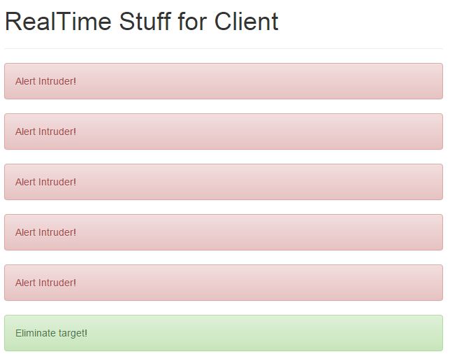

IOT: Security Detection System with Tessel and PubNub
=====================================================
This work is the result of PubNub/Tessel Hackathon on 10/25/2014 in SF.
Feel free to use this piece of code in anyway you would like. 
However, use it as your own risk. No guarantee is provided. 

Overview:
------------
- This contains a basic framework for informing clients of any unusual sound and light pattern in the environment.
- This is fully integrated with PubNub and Tessel. Basic functionality should be there for you to build anything on top of it.

Example of applications
-------------------------
- This could be used for detecting if intruders/someone enter a room/classified area. 
- Attached to any subject and alert client apps of any change in sound/light environment.

How it works:
-------------
- Tessel hardware (for this work) is equipped with Ambient and GPS modules. Everytime there is any unusual sound/light value occurred
(i.e. sudden loud sound or sudden change in light), it will broadcast this information via PubNub Channel.
Any client app (i.e. Mobile App or Desktop web app) will receive this information in real-time and can determine
what to do. 

For this particular work/example, after the client app receives 5+ notifications of an usual sound activity in the environment, 
the client app will send a command via PubNub, telling Tessel to blink LED light.

Current iteration (10/25/2014)
------------------------------
- Notifying client app (Desktop web app) when there is a sudden loud/change in the sound environment where Tessel is located.
- After 5 triggers, Client will send a command to Tessel hardware to execute a security protocol (in this example, blinking LED lights).
- Every time there is a new message/command from the client for Tessel hardware. It will blink its LED lights.


Future or possible iteration
-----------------------------
- Client App on mobile platform (Android/iOS) and be able to receive and send a command from/to Tessel via PubNub.
- Send back GPS's coordinates information and display a location on Google Map on Client Web/mobile apps whenever security protocol is triggered.


Requirements:
------------
- Tessel hardware	(Installation guide: http://start.tessel.io/install)
	- Ambient Module
	- GPS Module (Optional)
- PubNub account: It's FREE! (http://www.pubnub.com/)
	- Publish key
	- Subscription key
- Node.js command line (http://www.nodejs.org)
- Stable Wifi internet connection for Tessel
- index.html and hack.js from this repository.


How to setup Tessel development environment
--------------------------------------------
- Make sure to connect modules to the correct Tessel ports. There are 4 ports (A,B,C, and D) in Tessel hardware. (see http://start.tessel.io/modules)
- Make sure to install Tessel driver, please follow this guide http://start.tessel.io/install
- Make sure to install node.js command line
- Connect your Tessel via USB port to your computer.
- Open a command line (If windows, open it via node.js command line)

Prepare to run:
---------------
Client App (aka index.html)
- Make sure to define your PUBNUB subscription and publish keys.

Tessel Hardware code (aka hack.js)
- Make sure to define your PUBNUB subscription and publish keys.
- GPS_PORT and AMBIENT_PORT default ports are 'C' and 'A' respectively. If you change/switch the port, you will need to change this defined constants.
- (Optional) by setting a constant PS_CONNECT = true;, you will enable GPS module. By default, GPS is turned off.


Run the following commands:
----------------------------

1.) (Skip this, if you've already install node.js)
```sh
brew install node	
```

2.) Install Tessel driver
```sh
npm install -g tessel	
```

3.) This will update firmware/driver.
```sh
tessel update
```

4.) Install PubNub on your tessel device (if haven't)
```sh
npm install pubnub
```
NOTE: For PubNub/Tessel sponsored hackathon event, you may need to change it to 
```sh
npm install pubnub-hackathon.
```

5.) Install module drivers/dependencies

Ambient Module: 
```sh
npm install ambient-attx4
```
GPS Module: 
```sh
npm install gps-a2235h
```
6.) To get your Tessel connect to Wifi Internet,
```sh
tessel wifi -n [WIFI_NETWORK_NAME] -p [WIFI_PASSWORD]
```

7.) Deploying and execute the example code to Tessel hardware
```sh
tessel run [YOUR_TESSEL_JS_FILE]
```
In this example, 
```sh
tessel run hack.js
```
You should get the following screenshot or something similar


8.) Now the client app, just hit the page "index.html" on Google Chrome or any browser.

9.) Try clapping or shining a flashlight at Ambient module. If you see the following screenshot or something similar
then congratulation your client app is working. 


More information: http://www.pubnub.com/blog/tessel-pubnub-power-internet-of-things-4-lines-javascript/


